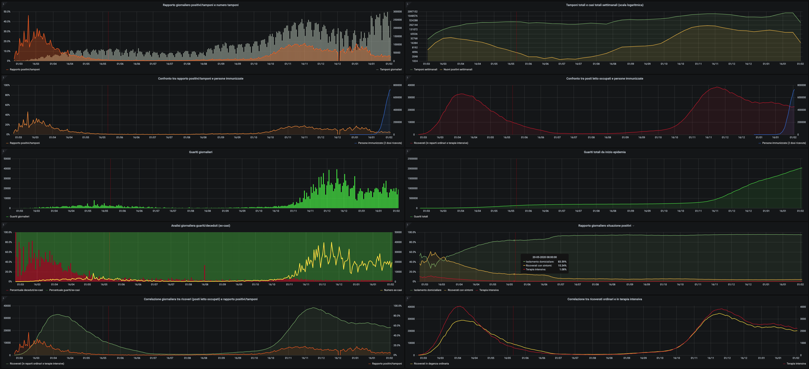

# covid-italy
Some templates to setup a covid-19 data analysis and visualization environment using Grafana (based on the data provided by Protezione Civile: https://github.com/pcm-dpc/COVID-19)

## Environment requirements

 - MySQL Server: https://www.mysql.com/
 - Grafana: https://grafana.com/
 - WorldMap Panel plugin for Grafana: https://grafana.com/grafana/plugins/grafana-worldmap-panel
 - Git: https://git-scm.com/
 - Python3: https://www.python.org/
 - Python libraries:
 - mysql-connector: `python3 -m pip install mysql-connector`
 - GitPython: `python3 -m pip install GitPython`

## Setup
- Install MySQL Server and Grafana
- Import database structure `dbCovid19.sql` into MySQL
- Modify and configure `updateDbCsv.py` script:
    - `dbHost`: database host
    - `dbUser`: database user
    - `dbPass`: database password
    - `dbName`: database name
    - `repoPath`: path where the data repository (by Protezione Civile) will be cloned (or pull, if already existing)
- Run `updateDbCsv.py` script to fetch data and populate db (this script should be run everyday to update the db with the last data provided by Protezione Civile)
- Import `covid19ItalyGrafanaTemplate.json` into Grafana (cofiguring Grafana to use the created db as data source)

Now you are able to visualize the already developed graphs and you have the data and the infrastructure to perform your analysis.

Snapshot: https://snapshot.raintank.io/dashboard/snapshot/ywzWUDEsxV3CLBqmaUJ7dgNW2q1Is74K
	
